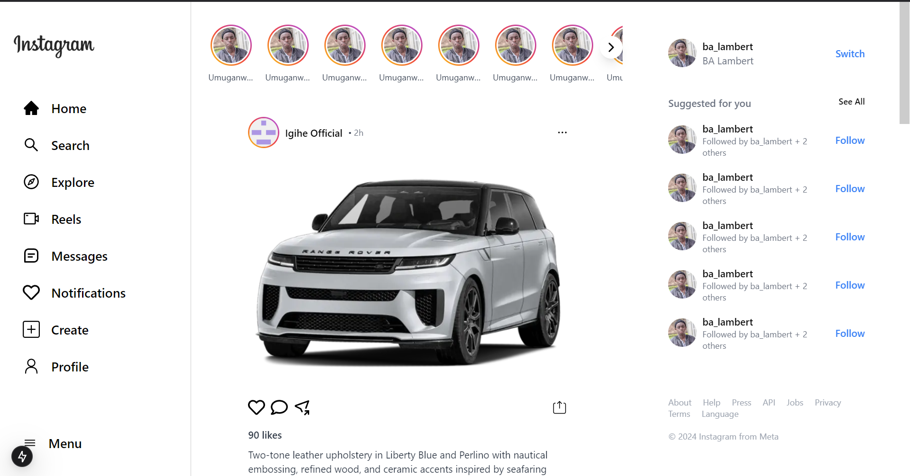
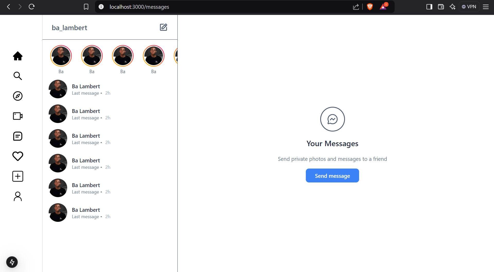
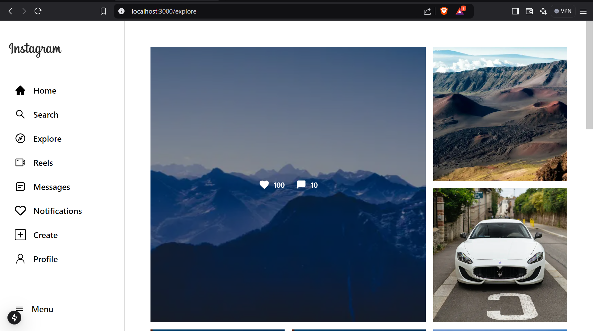
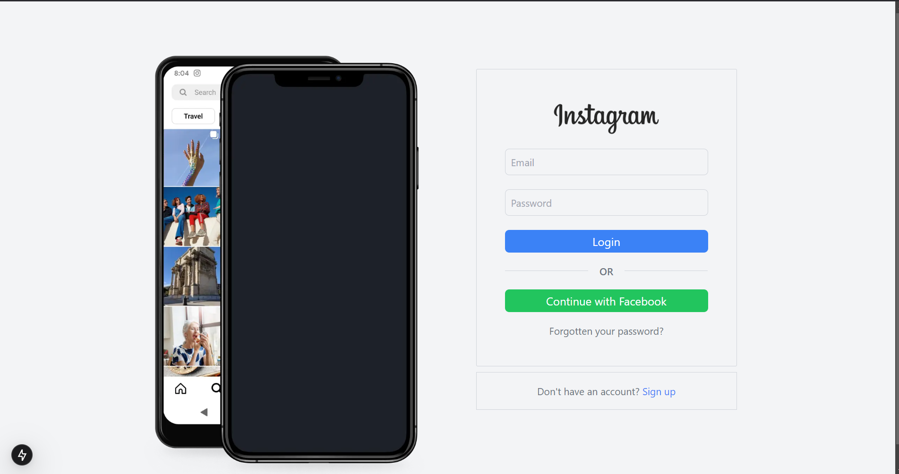
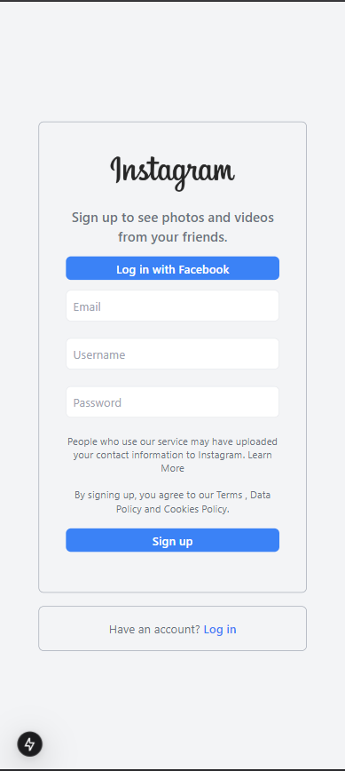
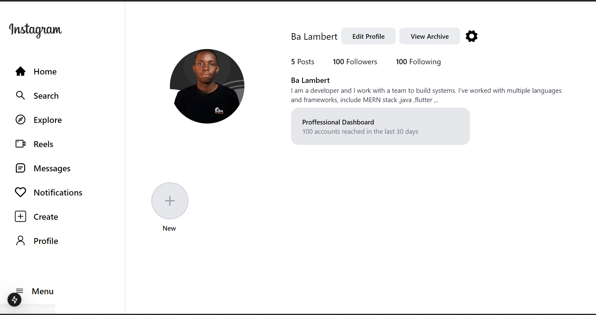
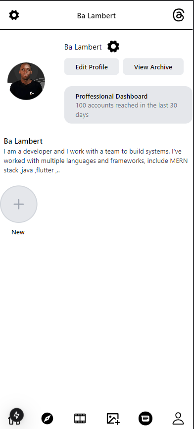
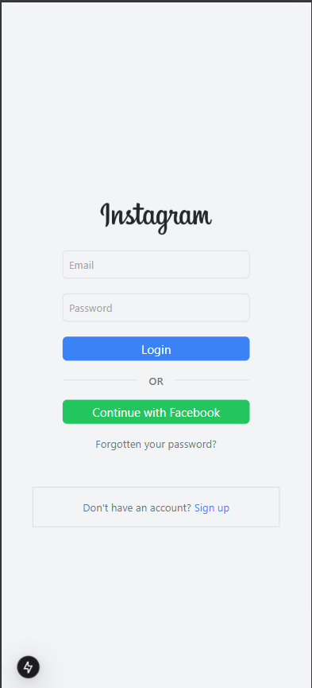

## Features in Detail

### Responsive Design
- Seamless transition between mobile and desktop views
- Instagram-style UI/UX patterns

### Navigation
- Mobile-friendly back navigation
- Smooth transitions between views
- Persistent chat list on desktop

## Design Notes

This is a UI implementation focused on recreating Instagram's messenger interface. It currently includes:
- Responsive layout matching Instagram's design
- Mobile and desktop view handling
- UI components and styling
- No backend integration or actual messaging functionality

## Author

Designed and Implemented by [Ba Lambert](https://github.com/balambert1)

## Screenshots

## Acknowledgments

- Design inspired by Instagram's messaging interface
- Icons provided by React Icons
- Special thanks to the Next.js and Tailwind CSS communities

---

© 2024 Ba Lambert. All Rights Reserved.
